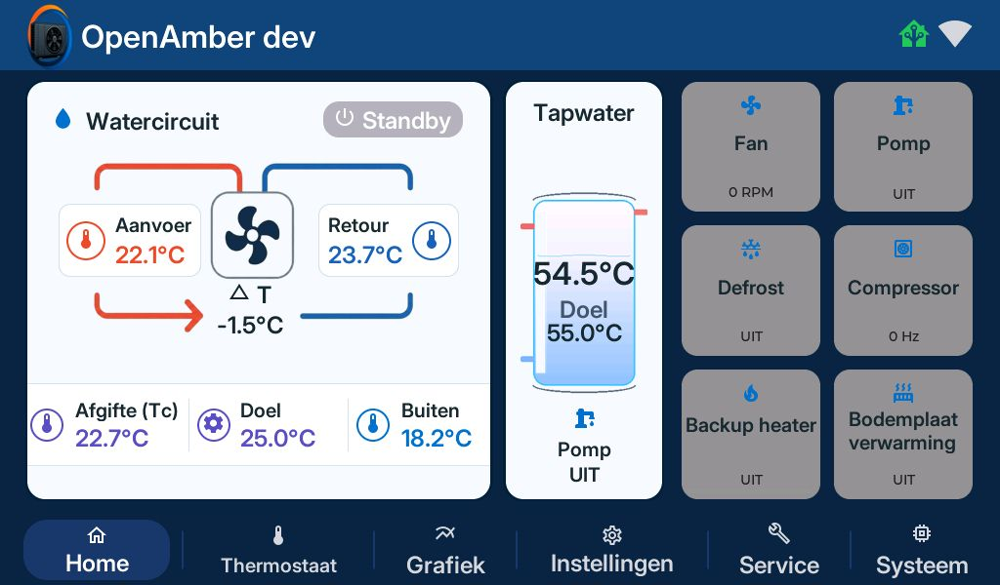

<p align="center">
  
</p>

<h1 align="center">OpenAmber Documentatie</h1>

<p align="center">
  De officiële documentatiebron voor <strong>OpenAmber</strong> — de moderne open-source vervanger voor de verouderde WinCE controller in Itho Daalderop Amber warmtepompen.
</p>

<p align="center">
  <a href="https://openamber.nl"><strong>openamber.nl »</strong></a>
  <br />
  <a href="https://openamber.nl/devices">Dashboard</a>
  ·
  <a href="#-lokaal-ontwikkelen">Lokaal ontwikkelen</a>
  ·
  <a href="#-bijdragen">Bijdragen</a>
</p>

---

## 📖 Over OpenAmber

OpenAmber vervangt het trage en gesloten WinCE display van de Itho Daalderop Amber warmtepomp door een moderne ESP32 microcontroller, aangedreven door ESPHome. Hiermee krijg je volledige controle, superieure modulatie en naadloze monitoring.

- ⚙️ **Moderne ESP32 controller:** Gebaseerd op ESPHome met snelle respons en stabiele communicatie.
- 🏠 **Home Assistant:** Directe en diepe integratie met Home Assistant via de native ESPHome API.
- 📈 **Vergroot modulatiebereik:** Stabieler moduleren en efficiënter draaien in deellast.
- 📊 **PID Compressor Modulatie:** Geavanceerde aansturing voor optimaal seizoensrendement.
- ❄️ **Intelligente defrost herstel:** Geoptimaliseerde logica na ontdooicycli met instelbare boost.
- 🔓 **100% Open Source:** Volledig transparant onder de GNU General Public License v3.

<p align="center">
  
</p>

---

## 🛠️ Lokaal ontwikkelen

Deze documentatie is gebouwd met [VuePress v2](https://v2.vuepress.vuejs.org/) en Vite.

### Vereisten

- [Node.js](https://nodejs.org/) (versie 18 of hoger)
- [npm](https://www.npmjs.com/)

### Starten van de ontwikkelserver

1. Clone de repository:
   ```bash
   git clone https://github.com/Jordi1990/openamber-docs.git
   cd openamber-docs
   ```

2. Installeer de benodigde packages:
   ```bash
   npm install
   ```

3. Start de lokale ontwikkelserver:
   ```bash
   npm run docs:dev
   ```
   Open vervolgens je browser op `http://localhost:8080`.

4. Documentatie bouwen voor productie:
   ```bash
   npm run docs:build
   ```
   De gegenereerde statische bestanden worden opgeslagen in `docs/.vuepress/dist/`.

---

## 📂 Projectstructuur

```text
openamber-docs/
├── .github/workflows/    # GitHub Actions (automatische deployment naar gh-pages)
├── docs/                 # Documentatie bronbestanden (Markdown)
│   ├── .vuepress/        # VuePress configuratie, thema en statische assets
│   ├── installatie/      # Installatiehandleidingen
│   ├── index.md          # Homepage van de documentatiewebsite
│   └── ...               # Overige documentatiepagina's
├── package.json          # Scripts en dependencies
└── README.md             # Deze GitHub repository landingspagina
```

---

## 🤝 Bijdragen

Verbeteringen aan teksten, ontbrekende handleidingen of aanvullingen zijn van harte welkom!

1. Fork de repository.
2. Maak een feature branch aan (`git checkout -b feature/nieuwe-pagina`).
3. Commit je wijzigingen (`git commit -m 'Voeg uitleg toe over ...'`).
4. Push naar je branch (`git push origin feature/nieuwe-pagina`).
5. Open een **Pull Request**.

---

## 📄 Licentie

Gedistribueerd onder de **GNU General Public License v3 (GPL-3.0)**. Zie [`LICENSE`](file:///g:/openamber-docs/LICENSE) voor meer informatie.
